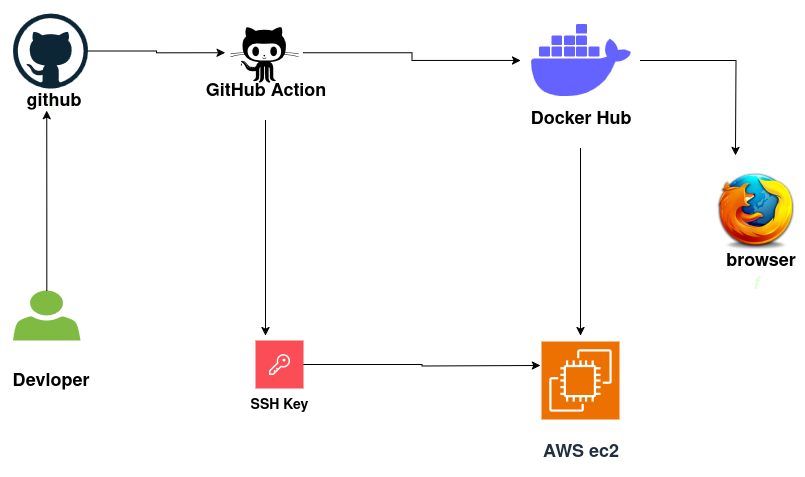
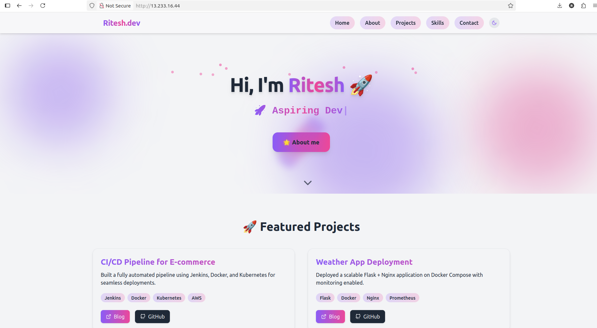
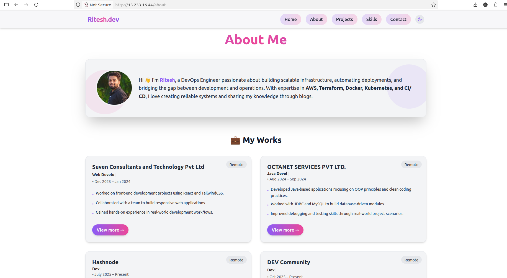
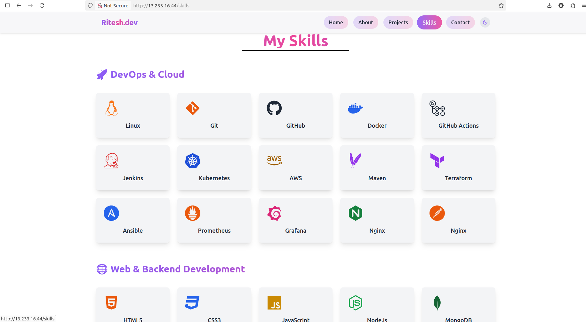
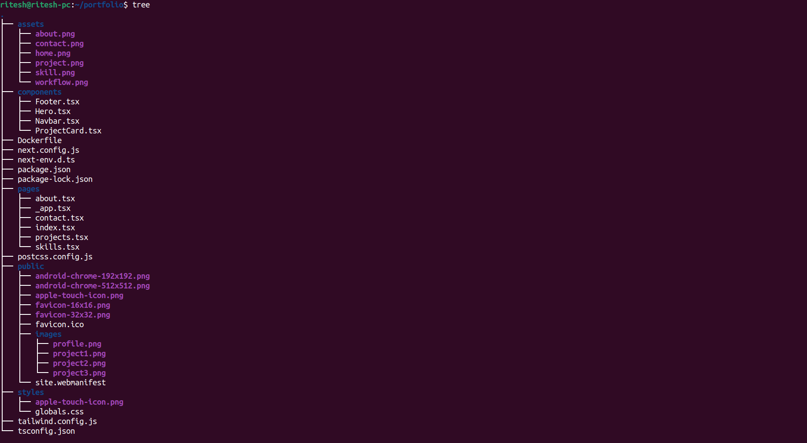

# 🚀 Next.js Portfolio – DevOps Ready

This is my **personal portfolio project** built with **Next.js**, containerized with **Docker**, deployed on **AWS EC2 (Free Tier)**, and automated with **GitHub Actions CI/CD** + **Terraform** for Infrastructure as Code.

It demonstrates both **frontend skills (React/Next.js)** and **DevOps practices (CI/CD, Docker, Cloud, IaC)**.  

## ⚡ Workflow



---

## [📸 Screenshots]

!
!



## 🚀 CI/CD Status


---


## 📑 Table of Contents
- [✨ Features](#-features)
- [🛠️ Tech Stack](#️-tech-stack)
- [📂 Project Structure](#-project-structure)
- [⚡ Workflow](#-workflow)
- [💻 Run Locally](#-run-locally)
- [📦 Docker Setup](#-docker-setup)
- [☁️ Deployment on AWS EC2](#️-deployment-on-aws-ec2)
- [🤖 GitHub Actions CI/CD](#-github-actions-cicd)
- [🧩 Terraform for Infrastructure](#-terraform-for-infrastructure)
- [📸 Screenshots](#-screenshots)
- [👨‍💻 Author](#-author)

---

## ✨ Features
- ⚛️ Modern portfolio built with **Next.js** (SSR + React 18).
- 📱 Responsive design for desktop & mobile.
- 🐳 Fully **Dockerized** (multi-stage build, production optimized).
- ☁️ Deployed on **AWS EC2 Free Tier**.
- 🔄 Automated **CI/CD pipeline** with GitHub Actions:
  - Runs tests (`npm run build`).
  - Builds and pushes Docker image to DockerHub.
  - SSH into EC2 and redeploys automatically.
- 📜 Infrastructure automated with **Terraform**.

---

## 🛠️ Tech Stack
- **Frontend**: Next.js, React, Tailwind CSS  
- **Containerization**: Docker, DockerHub  
- **CI/CD**: GitHub Actions  
- **Cloud**: AWS EC2 (Ubuntu 22.04, Free Tier)  
- **IaC**: Terraform  

---

## 📂 Project Structure 



## 💻 Run Locally

Clone the repo:

```
git clone git@github.com:ritesh355/portfolio.git
cd portfolio
```
Install dependencies:

```
npm install
```
Run dev server:

```
npm run dev
```
then visit **http://localhost:3000**

---

## 📦 Docker Setup
Build the image:
```
docker build -t ritesh355/nextjs-portfolio:latest .
```
run the container:
```
docker run -d -p 3000:3000 ritesh355/nextjs-portfolio:latest
```
then visit ***http://localhost:3000***


