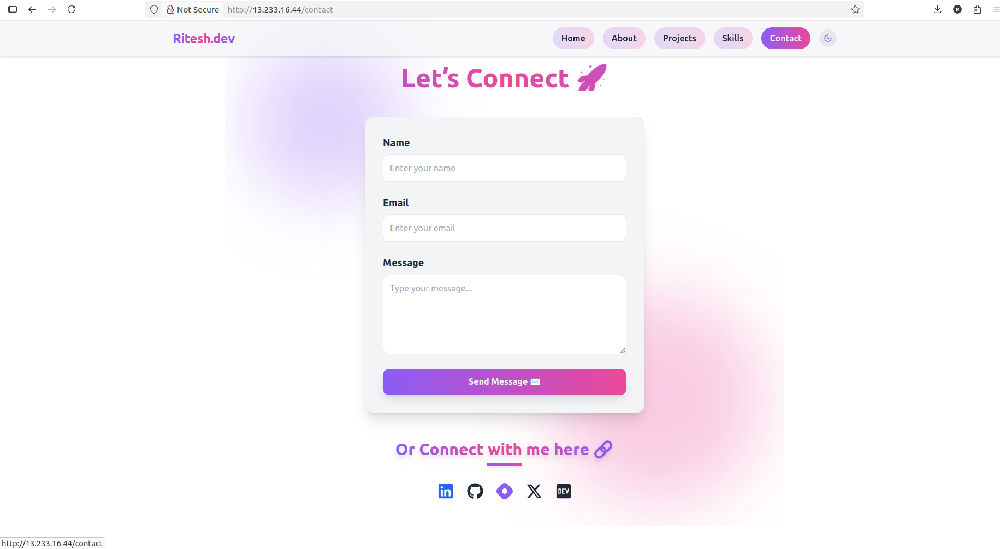

# 🚀 Next.js Portfolio – DevOps Ready

This is my **personal portfolio project** built with **Next.js**, containerized with **Docker**, deployed on **AWS EC2 (Free Tier)**, and automated with **GitHub Actions CI/CD** + **Terraform** for Infrastructure as Code.

It demonstrates both **frontend skills (React/Next.js)** and **DevOps practices (CI/CD, Docker, Cloud, IaC)**.  

## ⚡ Workflow


---

## [📸 Screenshots]

!
!




## 🚀 CI/CD Status


---


## 📑 Table of Contents
- [✨ Features](#-features)
- [🛠️ Tech Stack](#️-tech-stack)
- [📂 Project Structure](#-project-structure)
- [⚡ Workflow](#-workflow)
- [💻 Run Locally](#-run-locally)
- [📦 Docker Setup](#-docker-setup)
- [☁️ Deployment on AWS EC2](#️-deployment-on-aws-ec2)
- [🤖 GitHub Actions CI/CD](#-github-actions-cicd)
- [🧩 Terraform for Infrastructure](#-terraform-for-infrastructure)
- [📸 Screenshots](#-screenshots)
- [👨‍💻 Author](#-author)

---

## ✨ Features
- ⚛️ Modern portfolio built with **Next.js** (SSR + React 18).
- 📱 Responsive design for desktop & mobile.
- 🐳 Fully **Dockerized** (multi-stage build, production optimized).
- ☁️ Deployed on **AWS EC2 Free Tier**.
- 🔄 Automated **CI/CD pipeline** with GitHub Actions:
  - Runs tests (`npm run build`).
  - Builds and pushes Docker image to DockerHub.
  - SSH into EC2 and redeploys automatically.
- 📜 Infrastructure automated with **Terraform**.

---

## 🛠️ Tech Stack
- **Frontend**: Next.js, React, Tailwind CSS  
- **Containerization**: Docker, DockerHub  
- **CI/CD**: GitHub Actions  
- **Cloud**: AWS EC2 (Ubuntu 22.04, Free Tier)  
- **IaC**: Terraform  

---

## 📂 Project Structure 


## 💻 Run Locally

Clone the repo:

```
git clone git@github.com:ritesh355/portfolio.git
cd portfolio
```
Install dependencies:

```
npm install
```
Run dev server:

```
npm run dev
```
then visit **http://localhost:3000**

---

## 📦 Docker Setup
Build the image:
```
docker build -t ritesh355/nextjs-portfolio:latest .
```
run the container:
```
docker run -d -p 3000:3000 ritesh355/nextjs-portfolio:latest
```
then visit ***http://localhost:3000***

---
## ☁️ Deployment on AWS EC2 
1.Launch Ubuntu EC2 Free Tier.


2.after connetint that ec2 Install Docker:
```
sudo apt update && sudo apt install -y docker.io
sudo usermod -aG docker ubuntu
```
3. Pull and run image:
 ```
  docker pull ritesh355/nextjs-portfolio:latest
docker run -d -p 80:3000 ritesh355/nextjs-portfolio:latest
```
4.Visit http://EC2-Public-IP

---

## 🤖 GitHub Actions CI/CD

Located in .github/workflows/main.yml:

- Runs tests (npm run build).

- Builds & pushes image to DockerHub.

- SSH into EC2, pulls new image, restarts container.

  **Example Workflow**
  
```  
name: Build, Push & Deploy with Rollback

on:
  push:
    branches:
      - main

jobs:
  build-and-deploy:
    runs-on: ubuntu-latest

    steps:
    # 1. Checkout repo
    - name: Checkout code
      uses: actions/checkout@v3

    # 2. Setup Node.js
    - name: Setup Node.js
      uses: actions/setup-node@v3
      with:
        node-version: '18'

    # 3. Install dependencies
    - name: Install dependencies
      run: npm install --legacy-peer-deps

    # 4. Run build
    - name: Build project
      run: npm run build

    # 5. Log in to Docker Hub
    - name: Log in to Docker Hub
      uses: docker/login-action@v2
      with:
        username: ${{ secrets.DOCKER_USERNAME }}
        password: ${{ secrets.DOCKER_PASSWORD }}

    # 6. Build Docker image
    - name: Build Docker image
      run: |
        docker build -t ritesh355/nextjs-portfolio:latest \
                     -t ritesh355/nextjs-portfolio:v1 \
                     -t ritesh355/nextjs-portfolio:v1.0.0 .

    # 7. Push Docker image
    - name: Push Docker image
      run: |
        docker push ritesh355/nextjs-portfolio:latest
        docker push ritesh355/nextjs-portfolio:v1
        docker push ritesh355/nextjs-portfolio:v1.0.0

    # 8. Deploy to EC2 with rollback
    - name: Deploy to EC2
      uses: appleboy/ssh-action@v0.1.9
      with:
        host: ${{ secrets.EC2_HOST }}
        username: ${{ secrets.EC2_USER }}
        key: ${{ secrets.EC2_SSH_KEY }}
        script: |
          echo "Pulling latest Docker image..."
          docker pull ritesh355/nextjs-portfolio:latest

          # Backup old container if exists
          if docker ps -a --format '{{.Names}}' | grep -Eq "^nextjs-portfolio\$"; then
            echo "Backing up current container..."
            docker rename nextjs-portfolio nextjs-portfolio-backup
          fi

          # Run new container
          echo "Starting new container..."
          docker run -d --name nextjs-portfolio -p 80:3000 ritesh355/nextjs-portfolio:latest

          # Check if container is running
          sleep 5
          if ! docker ps --format '{{.Names}}' | grep -Eq "^nextjs-portfolio\$"; then
            echo "New container failed! Rolling back..."
            docker rm nextjs-portfolio || true
            docker rename nextjs-portfolio-backup nextjs-portfolio || true
            docker start nextjs-portfolio || true
          else
            echo "Deployment successful! Removing backup..."
            docker rm -f nextjs-portfolio-backup || true
          fi

```


## 👨‍💻 Author

**Ritesh Singh**

🌐 [LinkedIn](https://www.linkedin.com/in/ritesh-singh-092b84340/) 
|
📝 [Hashnode](https://ritesh-devops.hashnode.dev/) 
|
💻[GitHub](https://github.com/ritesh355/)

--- 
⚡ Built with ❤️ using Next.js + Docker + AWS + DevOps


